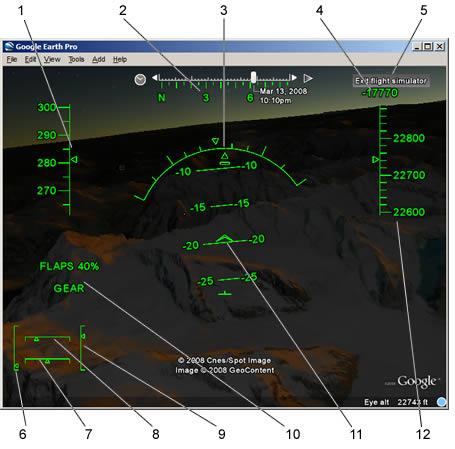

   

    1、速度(节)
    2、朝向
    3、倾角
    4、垂直速度(呎/ 分)
    5、结束模拟飞行功能
    6、节流阀
    7、方向舵
    8、副翼
    9、升降舵
    10、襟翼与起落架指示器
    11、俯仰角(度数)
    12、海拔高度(海平面以上的呎数)

若要隐藏或显示抬头显示器，请按下H。

您可以使用摇杆或滑鼠来执行模拟飞行功能。 若要使用滑鼠，请按一下萤幕中央使游标变成+ (十字)。 若要随时暂停或继续执行模拟飞行，请按下空格键。

若要起飞，请按下Page Up 键来增加推力并沿着跑道移动。 当您的飞机开始移动时，请稍微向后移动滑鼠或摇杆。 当速度足够时，飞机便会起飞。 若要改变飞机方向或倾斜度，请稍微移动滑鼠或摇杆。 请小心不要修正过度。 当机翼平衡时，请将滑鼠或摇杆置中。 若要四处观看，请按下箭头键+ Alt (慢) 或Ctrl (快)。

键盘快速键。

飞机降落

降落动作有点困难且需要一些时间练习。 若要将飞机降落：

    接近要降落的机场或平坦区域。
    按下Page Down来降低推力和飞机速度。
    按下G 放下起落架。
    按下F 增加襟翼设定，以降低飞机速度。
    在您落地之后，请使用机轮煞车来减缓飞机速度。 按下, (逗号) 使用左轮煞车；按下. (句号) 使用右轮煞车。
