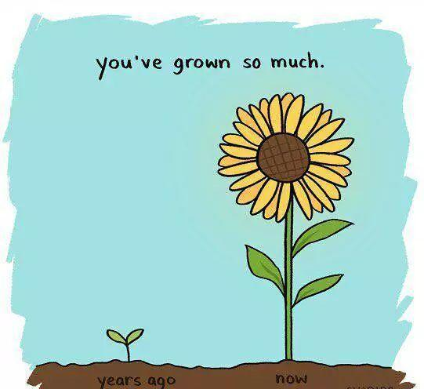

# 这10张海报能影响孩子的一生

童年时期，正是孩子性格塑造和习惯培养的最好时期，孩子也像海绵一样不断吸收着周围的一切，这个时候给与孩子正面的激励和鼓舞，将会对他一生都产生至关重要的影响。

下面这10张英文海报，大家可以打印下来，贴在家里显眼的角落，也可以制作成卡片，放在随手可得的地方。而且这些图片除了英文外，还配有萌萌哒小动物，花花草草等，相信喜欢新鲜事物的孩子们绝对难以抗拒这种魅力。

早点告诉我多好！在家贴这10张海报能影响孩子的一生

1.You may be small,but you can accomplish BIG things!

你可能很小，但你也可以做大事！

孩子虽然年纪还小，但总有一些伟大的抱负和梦想。家长不要打击孩子的自信心，要相信他们，并告诉孩子，只要努力就能够完成这些梦想！

2.Please don't blame yourself for things you couldn't control, sometimes it's just not your fault.

请不要因为你无法控制的事情责怪自己，有时这不是你的错。

作为成年人我们知道生活中有很多变数和无奈，我们尚且会有很多事情无法做到，就不要苛求孩子了。当他们为一件无法做到的事情沮丧时，请抱抱孩子，说：“宝贝，你已经很棒了！”

3.You are not a failure,you may have made mistakes,but that dose not mean you have failed.

你不是一个失败者，你可能犯过错误，但这并不意味着你失败了。

孩子，失败了没关系，重要的是再站起来。自然界没有风风雨雨，大地就不会春华秋实。每一次从错误中汲取经验，就会离成功更近一步。

4.It's okay to be tired.don't feel guilty about it!you're not expected to have infinite energy.

累了也没关系。不要为此感到内疚!你不会有无限的能量。

现在的孩子经常被各种补习班，兴趣班压的喘不过气，不用为没有达到某些目标而内疚难过，只要尽力了你就是最棒的！累了还有爸爸妈妈呢。

5.Things we we all need more of warm hugs,good sleep,adwentures,interestings conversationgs,laughter,happy dances.

我们都需要更多温暖的拥抱,良好的睡眠,冒险,有趣的对话,欢笑,快乐的舞蹈。

拥抱意味着爱与温暖，睡眠对孩子的身体发育十分重要，冒险精神是孩子天生的对未知事物的探索欲望，让孩子成为一个有爱心，有好奇心，拥有有趣灵魂的人，当然，最重要的是快乐。

6.You've grown so much.

你已经长大这么多了。

宝贝，我见证你的成长，你像一颗小树苗，在阳光雨露下茁壮成长。一晃眼你那么大了，从前那个跟在妈妈身后的小尾巴，如今成了可以独当一面的大孩子了。

7.Some flowers bloom in the day.some flowers bloom at night.

some in the spring,some in winter.you are a flower.let you be you.

有些花在白天开花。有些花在晚上开花。有的在春天，有的在冬天。你是一朵花，做你自己就好。

孩子，每朵花的花期不一样，所以我们才能在一年四季欣赏到各种绚烂的花儿，每个小孩都有自己不一样的闪光点，有的现在散发光芒，有的以后闪耀一方，不要害怕和别人不一样，也不要恐惧未来，做你自己就是最好的。

8.You care so much about others.Don't forget to take care of yourself.

你太关心别人了，也别忘了照顾好你自己。

孩子，你很懂得关心体贴他人，善良永远是一个人身上最可贵的品质。但也别忘了照顾好自己，别因为任何人和事而委屈自己，你自己的感受，比什么都重要。

9.Everyone has their own unique qualities that make them special.don't let others distract you from your own light!

每个人都有自己独特的特质让他们与众不同。不要让别人夺走你的光芒。

每个人都像一只万花筒，外表平平无奇，实际上绚丽无比。不要羡慕别人的长处，因为宝贝，你的长处在别处。

10.Hard work won't pay off if you're working towards the wrong things.make sure you are in the right direction first.

如果你正朝着错误的方向努力，努力工作是不会有回报的。首先确保你的方向是正确的。

任何一件事想要成功，每一个目标的达成，都需要付出努力，但是只有朝着正确的方向努力，这种付出才有价值。所以，一定要花费一些时间找准方向，这样才能确保每份努力不会白费。

