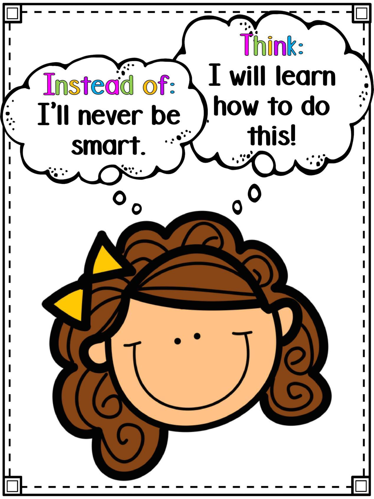

# 斯坦福大学：用10张海报养成孩子的坚毅好品格
2018-04-19 11:06

在美国的教室里，也有类似中国的黑板报，不过他们是在墙上贴的海报。

这种一般有9句话组成的海报，可不只是为了美观，它还可以成为教学工具，帮助孩子建立成长型思维。

到底什么是成长型思维呢？

斯坦福大学的心理学教授卡罗尔·德伟克博士，在一场TED演讲中，把思维模式分成两种：固定型和成长型。

拥有成长型思维的孩子，不会畏惧困难和挑战，他们喜欢挑战，相信能力是可以得到提升的。

但固定型思维的孩子，不懂得享受学习的过程，只盯住眼前的成功或失败。为了寻求自我安慰，他们甚至会选择作弊，或逃避困难。

简单来说，成长型思维，能让孩子更积极主动地挑战困难，提高承受压力的能力和解决问题的能力。

如何养成孩子的成长型思维？

可以参考下面这10张海报，用聊天的方式养成孩子的思维方式。

01

固定型思维：I'm not good at this!我不擅长这个。

成长型思维：what am i missing?我会错过什么？

02

固定型思维：I give up!我放弃啦。

成长型思维：I’ll use a different strategy.我要用另一种方法试试看。

03

固定型思维：This is good enough.这样已经够好的了。

成长型思维：Is this my best work?我还能做得更好吗？

04

固定型思维：I made a mistake!我犯错了。

成长型思维：Mistakes help me learn!失误能让我学会更多。

05

固定型思维：My friend can do it.我朋友可以做这个。

成长型思维：I can learn from them.我可以在一边旁观学习。

06

固定型思维：This is too hard!这太难了！

成长型思维：This may take some time.只需要多花点时间而已。

07

固定型思维：I just can’t do this!我就是做不到！

成长型思维：I’m going to train my brain.我要发动我的大脑了。

08

固定型思维：I can’t make this better.我尽力了。

成长型思维：I can always improve!下一次我能做得更好。

09

固定型思维：My plan didn’t work!我的计划失败了。

成长型思维：There’s always Plan B.没关系，我还有Plan B。

10

固定型思维：I will never be smart.我永远都不会变聪明。

成长型思维：I will learn how to do this!我一定可以学会如何做到这一点。

这些海报可不只是装饰，而是被老师用作了教学工具。在美国教室里，老师会借助海报上的内容，跟学生这样聊天：

当学生说“我做不来”时，用“试着去做”，鼓励学生寻找解决问题的新办法；

当学生犯错误时，老师甚至会说，哇，我一直在等待有人用这种方式解决问题，这样我就可以用来提醒后面的学生；

当学生表达“下次会更努力”时，引导孩子换成这种具体的表达——周末我会多用30分钟的时间来练习拼写。

遇到困难和挫折时，引导学生用上面这种更具体更积极的方式，来描述自己的心态和行为，有利于目标的完成。

有研究表明，这些海报上的短句子，可以明显提高学生们的平均成绩。

这是因为，讨论海报上的句子，可以引导孩子形成积极的成长型思维，提高孩子承受压力的能力，有助于解决实际问题。

结束语

我们在家里也可以参考美国教室里的海报，建立这样一个海报公告栏。

每天、每周或者每月选择其中一张主题海报，通过聊天或讨论的方式，逐步帮助孩子养出成长型思维。
